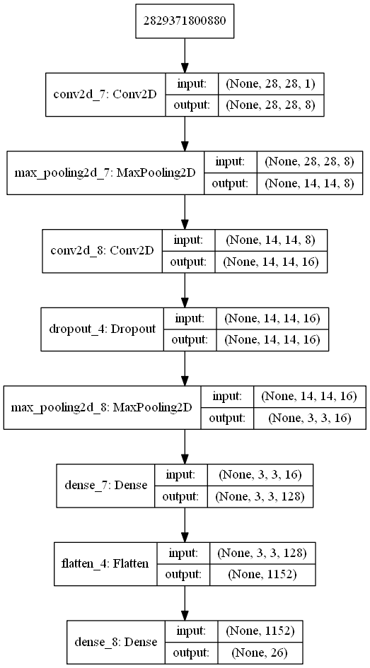
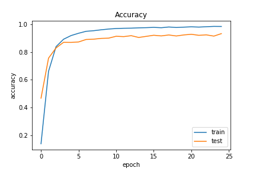

# Sign Language Alphabet Recognition (Except letter J & Z)

- **Link of training and testing Dataset**: https://www.kaggle.com/datamunge/sign-language-mnist
- **Demo**: https://drive.google.com/open?id=1u9zT3cZkj7vMGEXofL3sQrKooFO8mLL8

### Requires:
- Python 3.6
- OpenCV-Python 4.0.0.21
- Keras 2.2.4
- Numpy 1.17.4
- Pandas 0.25.1
- Scipy 1.3.3

### CNN Model Processing

### CNN model accuracy when training and testing with MINST Dataset

